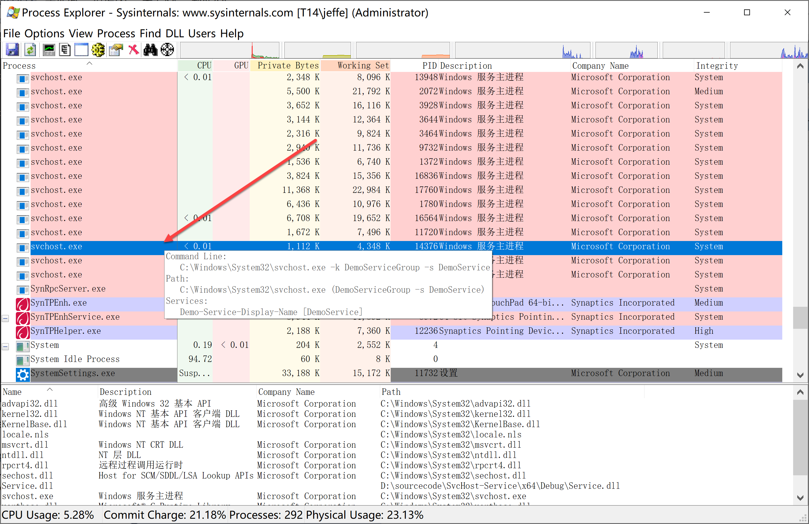
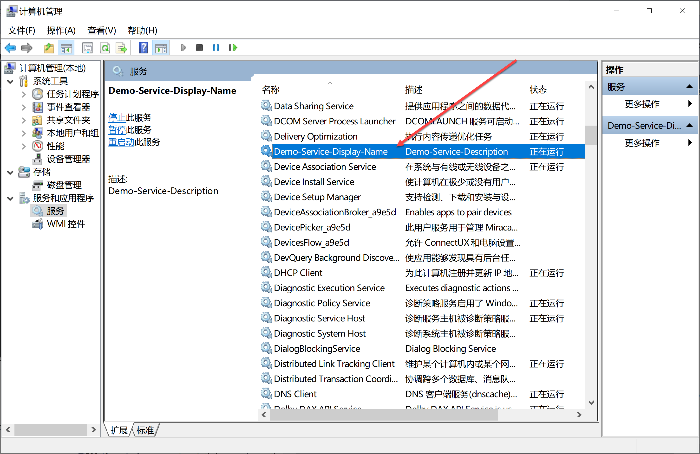

# SvcHost-Service
An windows service that runs in svchost.exe.

# Service Project
`Service` project is a SvcHost-based service framework, you can add your custom code to `ServiceMain` function(like `WinMain` or `main`):
```c++
// ServiceMain.cpp

void ServiceMain(HANDLE hPauseEvent, HANDLE hStopEvent) {
  // Add your custom code to here!
  //
}
```

# Install Project
`Install` project is a sample about how to install/uninstall/start/stop SvcHost-based service.

The core function provide by `ServiceInstaller` class.

# Test Project
`Test` project is a test project that load dll and call DllMain function directly.

# Screenshot



